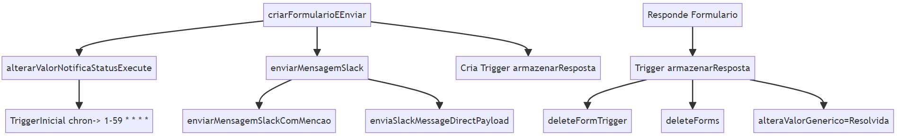
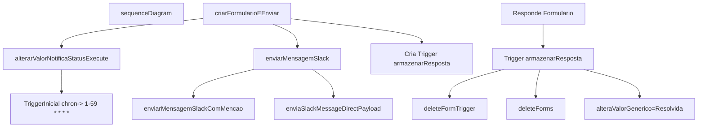

# SCOT - System Closing Orchestration Tool

Solução desenvolvida para auxiliar nas rotinas de Fechamento Contábil do Grupo Boticário.
Fesenvolvidos que executam operações de apoio à planilha que mantem as atividades do fechamento contábil.

## Estrutura das Functions no Google Apps Script

<!--  -->



## Funções Principais

### `criarFormularioEEnviar(id)`
Cria um formulário com base nos dados de uma linha específica da planilha e o envia para o executor da atividade.

### `armazenarResposta(e)`
Armazena a resposta do formulário enviado, atualiza a planilha com a resposta e executa ações associadas à resposta.

## Funções Auxiliares

### `enviaSlackMessageDirectPayload(token, mensagem, userId)`
Envia uma mensagem direta para um usuário no Slack.

### `enviarMensagemSlackComMencao(webhookUrl, mensagem, username)`
Envia uma mensagem para um canal do Slack mencionando um usuário.

### `deleteFormTrigger(formsID)`
Exclui a trigger associada a um formulário.

### `deleteForms(formsID)`
Exclui um formulário.

## Funções de Configuração e Agendamento

### `onInstall()`
Executada quando o script é instalado como um complemento.

### `onOpen()`
Executada quando a planilha é aberta.

### `armazenarRespostaAgendar()`
Agenda a execução da função `armazenarResposta`.

### `alterarValorNotificaStatusExecuteAgendar()`
Agenda a execução da função `alterarValorNotificaStatusExecute`.

## Funções Acionadas pelo usuário

### `adicionarLinhaComFormulas(nomeDaAba, linhaParaCopiar)`
Insere uma nova linha na planilha com base em uma linha modelo. É acionada após o Usuário Clicar em um Botão na Planilha.

## Funções Genéricas

### `alteraValorGenerico(valor, colunaOrigem, colunaDestino, novoValor, nomeAba)`
Localiza um valor em uma coluna e altera o valor correspondente em outra coluna.

## Funções de Atualização de Status

### `alterarValorNotificaStatus(qValor, novoValorF, abaPlanilha)`
Atualiza o status das tarefas na planilha e envia formulários para executores quando necessário.

### `alterarValorNotificaStatusExecute()`
Subfunção que atualiza o status das tarefas para "Iniciada".


# Documentação do Aplicativo Slack Bot

Este documento fornece uma visão geral do aplicativo Slack e explica como ele funciona. O Aplicativo criado para receber a resposta do formulário criado através do "Slack Block Kit" para receber a resposta do Usuário após a execução da Atividade.

## Introdução

O aplicativo Slack é uma integração que permite interagir com o Slack através de mensagens e ações em blocos. Ele pode ser configurado para responder a eventos específicos e executar ações em resposta a esses eventos.

## Configuração

Antes de usar o aplicativo Slack, você precisa configurar algumas variáveis de ambiente e permissões de integração:

- `SLACK_BOT_TOKEN`: Token de autenticação do bot Slack.
- `SLACK_SIGNING_SECRET`: Segredo de assinatura do Slack para verificar solicitações recebidas.
- `REFRESH_TOKEN`: Token de atualização para autenticação com uma API externa.
- `CLIENT_ID`: ID do cliente para autenticação com a API externa.
- `CLIENT_SECRET`: Segredo do cliente para autenticação com a API externa.
- `URLAPI`: URL da API externa para enviar dados.

## Funcionalidades

O aplicativo Slack possui as seguintes funcionalidades principais:

### 1. Manipulação de Eventos

O aplicativo pode manipular eventos do Slack, como cliques em botões.

### 2. Envio de Mensagens

Ele pode enviar mensagens para canais Slack em resposta a eventos.

### 3. Integração com API Externa

O aplicativo integra-se a uma API externa para realizar ações adicionais, como gravar respostas em um banco de dados.

## Utilização

O aplicativo é implantado como uma Cloud Function no Google Cloud Platform. Ele escuta solicitações HTTP POST e executa a lógica com base nos dados recebidos.

### Exemplo de Uso

```javascript
// Enviar uma mensagem para o chat e realizar uma requisição POST para uma API externa
async function exemploUso() {
  // Enviar mensagem no chat
  await app.client.chat.postMessage({
    token: process.env.SLACK_BOT_TOKEN,
    channel: 'channel_id',
    text: 'Mensagem de exemplo!'
  });

  // Realizar a requisição POST
  await enviarPostParaURL(value, action_id);
}
```


## Desenho Alto nível da Solução


